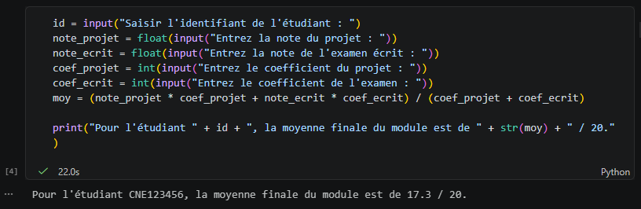
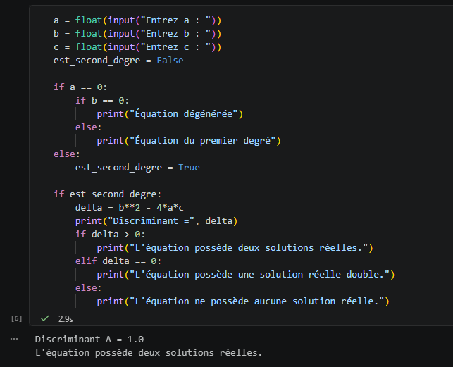
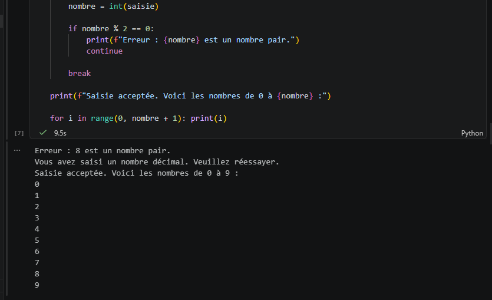
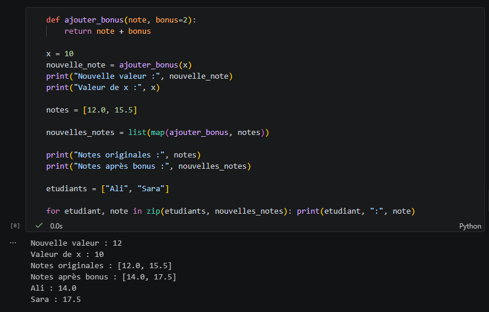
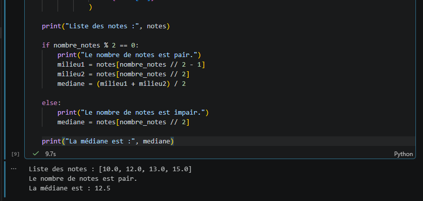
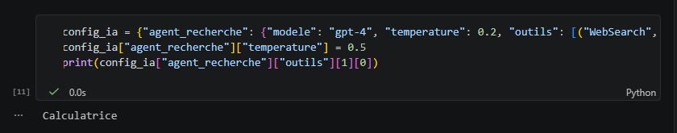

# TP1 - Python - Partie 1

<p align="center">
  
  
  
</p>

Ce projet correspond au premier TP de Python, centré sur les bases de la programmation et les structures essentielles du langage :

- conversions de types
- conditions
- boucles
- fonctions
- listes
- dictionnaires

Le travail a été réalisé dans le notebook `TP1python_partie1.ipynb` et complété par des scripts Python illustrant les réponses aux exercices.

---

## Technologies utilisées

- Python 3
- Jupyter Notebook
- VS Code
- GitHub
- Bibliothèque standard Python

---

## Objectif du TP

Le TP a pour but de renforcer les compétences de base en Python, notamment :

1. manipuler les types de données (`int`, `float`, `str`)
2. utiliser les structures conditionnelles (`if`, `elif`, `else`)
3. appliquer les boucles `for` et `while`
4. créer des fonctions réutilisables
5. manipuler des listes et des dictionnaires
6. comprendre les structures de données utiles à l’IA agentique

---

## 1. Conversion de types et moyenne pondérée

Dans cet exercice, il fallait demander à l’utilisateur :

- son identifiant (chaîne de caractères)
- la note du projet et l’examen (conversion en `float`)
- les coefficients du projet et de l’examen (conversion en `int`)

Ensuite, on calculait la moyenne pondérée.

La réponse réalisée a donné le résultat suivant :

- identifiant : `CNE123456`
- moyenne calculée : `17.3 / 20`

### Capture d’écran



---

## 2. Structures conditionnelles : équation du second degré

On a demandé à l’utilisateur de saisir les coefficients `a`, `b` et `c` d’une équation de la forme :

$$
ax^2 + bx + c = 0
$$

Puis on a vérifié si `a = 0`, puis calculé le discriminant :

$$
\Delta = b^2 - 4ac
$$

Selon la valeur de `Δ`, le programme affiche :

- deux solutions réelles si `Δ > 0`
- une solution double si `Δ = 0`
- aucune solution réelle si `Δ < 0`

### Réponse obtenue

Les valeurs saisies donnent :

- `a = 1`
- `b = 2`
- `c = 3`
- `Δ = 1.0`

Résultat : l’équation possède deux solutions réelles.

### Capture d’écran



---

## 3. Boucles `while` et `for` : validation de saisie

L’objectif était de forcer l’utilisateur à saisir un nombre entier impair. Si la valeur était :

- paire → erreur
- décimale → erreur
- valide → acceptation

Ensuite, le programme affichait tous les nombres de `0` jusqu’au nombre saisi.

### Réponse obtenue

La saisie a été rejetée d’abord pour un nombre pair, puis acceptée pour `9`.

Le programme a affiché :

`0 1 2 3 4 5 6 7 8 9`

### Capture d’écran



---

## 4. Fonctions, `map()` et `zip()`

Le sujet consistait à créer une fonction :

```python
def ajouter_bonus(note, bonus=2):
    return note + bonus
```

Ensuite :

- on a vérifié que la variable `x` reste inchangée après appel de la fonction
- on a utilisé `map()` pour appliquer le bonus à une liste de notes
- on a utilisé `zip()` pour associer chaque étudiant à sa nouvelle note

### Réponse obtenue

- `x = 10` → la fonction ne modifie pas la variable originale
- notes originales : `[12.0, 15.5]`
- notes avec bonus : `[14.0, 17.5]`
- sortie obtenue :
  - `Ali : 14.0`
  - `Sara : 17.5`

### Capture d’écran



---

## 5. Listes et calcul de la médiane

On a demandé à l’utilisateur de saisir plusieurs notes dans l’ordre croissant, puis de calculer la médiane.

Le programme a vérifié si le nombre de notes était :

- pair → moyenne des deux valeurs centrales
- impair → valeur centrale unique

### Réponse obtenue

La liste saisie était :

```python
[10.0, 12.0, 13.0, 15.0]
```

Comme le nombre de notes est pair, la médiane a été calculée comme :

$$
\frac{12 + 13}{2} = 12.5
$$

### Capture d’écran



---

## 6. Structures de données pour l’IA agentique : dictionnaires

Dans ce dernier exercice, on a construit un dictionnaire `config_ia` pour représenter la configuration d’un agent de recherche.

Le dictionnaire contenait :

- le modèle (`gpt-4`)
- la température (`0.2`)
- une liste d’outils sous forme de tuples

On a ensuite modifié la température à `0.5` puis affiché uniquement le nom de l’outil `Calculatrice`.

### Réponse obtenue

Sortie affichée :

```python
Calculatrice
```

### Capture d’écran



---

## Conclusion

Ce TP a permis de maîtriser les bases de Python à travers des exercices pratiques et progressifs. J’ai pu appliquer :

- les conversions de types
- les conditions logiques
- les boucles de contrôle
- les fonctions et leurs paramètres
- les listes et le calcul de médiane
- les dictionnaires pour organiser des configurations d’agent

C’est une base fondamentale très utile pour la programmation Python, et surtout pour la mise en place de systèmes intelligents et d’applications plus complexes dans le domaine de l’IA.

---

## Fichiers du projet

- `TP1python_partie1.ipynb` : notebook principal contenant les cours et les exercices
- `captures/` : captures des sorties des réponses
- `src/` : code source du projet

